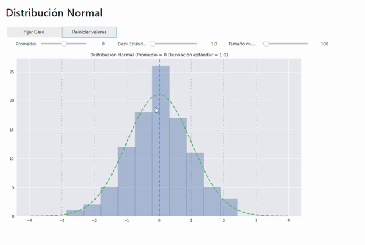

# Herramientas interactivas para el aprendizaje de estadística

## Estadística univariada
* [Distribución normal](https://mybinder.org/v2/gh/Yagwar/stats_interact/master?urlpath=%2Fvoila%2Frender%2Fdist_normal.ipynb) 

## Estadística Bivariada
* [Correlación](https://mybinder.org/v2/gh/Yagwar/stats_interact/master?urlpath=%2Fvoila%2Frender%2Fcorrelaciones.ipynb)

Hecho con : 
